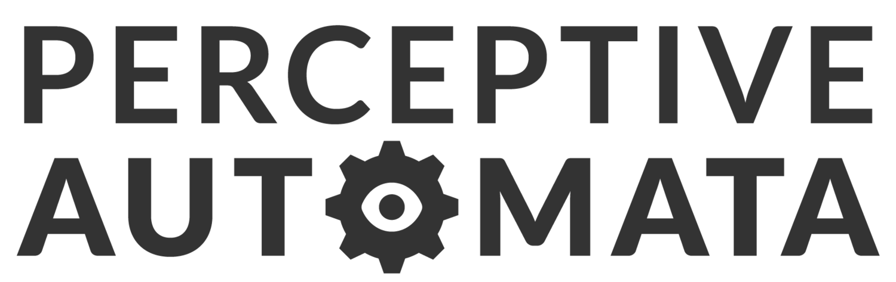

<!-- Improved compatibility of back to top link: See: https://github.com/othneildrew/Best-README-Template/pull/73 -->
<a name="readme-top"></a>
<!--
*** Thanks for checking out the Best-README-Template. If you have a suggestion
*** that would make this better, please fork the repo and create a pull request
*** or simply open an issue with the tag "enhancement".
*** Don't forget to give the project a star!
*** Thanks again! Now go create something AMAZING! :D
-->


<!-- PROJECT SHIELDS -->
<!--
*** I'm using markdown "reference style" links for readability.
*** Reference links are enclosed in brackets [ ] instead of parentheses ( ).
*** See the bottom of this document for the declaration of the reference variables
*** for contributors-url, forks-url, etc. This is an optional, concise syntax you may use.
*** https://www.markdownguide.org/basic-syntax/#reference-style-links
-->
[![Contributors][contributors-shield]][contributors-url]
[![MIT License][license-shield]][license-url]
[![LinkedIn][linkedin-shield]][linkedin-url]


<!-- PROJECT LOGO -->
<br />
<div align="center">
  <a href="https://github.com/adithyagaurav/pedestrian-behavior-prediction">
    
  </a>

<h3 align="center">Are They Going To Cross? Pedestrian Behavior Prediction</h3>

  <p align="center">
    Computer vision module to predict behavior of pedestrians in autonomous driving.
  </p>
</div>


<!-- TABLE OF CONTENTS -->
<details>
  <summary>Table of Contents</summary>
  <ol>
    <li>
      <a href="#about-the-project">About The Project</a>
      <ul>
        <li><a href="#built-with">Built With</a></li>
      </ul>
    </li>
    <li>
      <a href="#getting-started">Getting Started</a>
      <ul>
        <li><a href="#prerequisites">Prerequisites</a></li>
        <li><a href="#installation">Installation</a></li>
      </ul>
    </li>
    <li><a href="#license">License</a></li>
    <li><a href="#contact">Contact</a></li>
    <li><a href="#acknowledgments">Acknowledgments</a></li>
  </ol>
</details>


<!-- ABOUT THE PROJECT -->
## About The Project

[![Pedestrian Crossing Demo][product-screenshot]]()

The aim of this project is to design a computer vision software pipeline using data science and machine learning principles to estimate the intent of pedestrians, specifically whether they are going to cross in front of the autonomous driving vehicle. We accomplish this by analyzing the behavior cues humans display before crossing the road.

<p align="right">(<a href="#readme-top">back to top</a>)</p>


### Built With

* [![Python][Python-badge]][Python-url]
* [![PyTorch][PyTorch-badge]][PyTorch-url]
* [![Numpy][Numpy-badge]][Numpy-url]
* [![Scikit-learn][scikit-learn-badge]][scikit-learn-url]
* [![Pandas][Pandas-badge]][Pandas-url]
* [![Matplotlib][Matplotlib-badge]][Matplotlib-url]
* [![OpenCV][OpenCV-badge]][OpenCV-url]

<p align="right">(<a href="#readme-top">back to top</a>)</p>


<!-- GETTING STARTED -->
## Getting Started

The dataset used in this project is the JAAD dataset, the dataset consists of tracked pedestrians in some videos from a car's dashcam. Each of these pedestrians have been carefully annotated with a bunch of different attributes, such as whether or not they are stopped or moving fast or moving slow.

### Prerequisites

This is an example of how to list things you need to use the software and how to install them.
* Python & pip
  ```sh
  sudo apt-get install python3.6
  curl https://bootstrap.pypa.io/get-pip.py -o get-pip.py
  python get-pip.py
  ```
* PyTorch
  ```sh
  pip install torch
  pip install torchvision
  ```
* Numpy, Pandas, Matplotlib, Sklearn
  ```sh
  pip install numpy
  pip install pandas
  pip install matplotlib
  pip instakk sklearn
  pip install opencv-python
  ```


### Installation

1. Clone the repo
   ```sh
   git clone https://github.com/adithyagaurav/pedestrian-behavior-prediction.git
   ```
3. Download the JAAD dataset videos
4. Step through the Jupyter notebook Pedestrian_estimation_code.ipynb

<p align="right">(<a href="#readme-top">back to top</a>)</p>
<!-- LICENSE -->

## License

Distributed under the MIT License. See `LICENSE.txt` for more information.

<p align="right">(<a href="#readme-top">back to top</a>)</p>


<!-- CONTACT -->
## Contact

Adithya Singh - agsingh@umd.edu

Project Link: [https://github.com/adithyagaurav/pedestrian-behavior-prediction](https://github.com/adithyagaurav/pedestrian-behavior-prediction)

<p align="right">(<a href="#readme-top">back to top</a>)</p>


<!-- ACKNOWLEDGMENTS -->
## Acknowledgments

* [Amir Rasouli, Iuliia Kotseruba, and John K Tsotsos. Are
they going to cross? A benchmark dataset and baseline for
pedestrian crosswalk behavior. In ICCVW, pages 206–213,
2017](https://data.nvision2.eecs.yorku.ca/JAAD_dataset/)

<p align="right">(<a href="#readme-top">back to top</a>)</p>


<!-- MARKDOWN LINKS & IMAGES -->
<!-- https://www.markdownguide.org/basic-syntax/#reference-style-links -->
[contributors-shield]: https://img.shields.io/github/contributors/adithyagaurav/pedestrian-behavior-prediction.svg?style=for-the-badge
[contributors-url]: https://github.com/adithyagaurav/pedestrian-behavior-prediction/graphs/contributors
[forks-shield]: https://img.shields.io/github/forks/adithyagaurav/pedestrian-behavior-prediction.svg?style=for-the-badge
[forks-url]: https://github.com/adithyagaurav/pedestrian-behavior-prediction/network/members
[stars-shield]: https://img.shields.io/github/stars/adithyagaurav/pedestrian-behavior-prediction.svg?style=for-the-badge
[stars-url]: https://github.com/adithyagaurav/pedestrian-behavior-prediction/stargazers
[issues-shield]: https://img.shields.io/github/issues/adithyagaurav/pedestrian-behavior-prediction.svg?style=for-the-badge
[issues-url]: https://github.com/adithyagaurav/pedestrian-behavior-prediction/issues
[license-shield]: https://img.shields.io/github/license/adithyagaurav/pedestrian-behavior-prediction.svg?style=for-the-badge
[license-url]: https://github.com/adithyagaurav/pedestrian-behavior-prediction/blob/master/LICENSE.txt
[linkedin-shield]: https://img.shields.io/badge/-LinkedIn-black.svg?style=for-the-badge&logo=linkedin&colorB=555
[linkedin-url]: https://www.linkedin.com/in/adithyagsingh/
[product-screenshot]: images/output.gif
[Next.js]: https://img.shields.io/badge/next.js-000000?style=for-the-badge&logo=nextdotjs&logoColor=white
[Next-url]: https://nextjs.org/
[React.js]: https://img.shields.io/badge/React-20232A?style=for-the-badge&logo=react&logoColor=61DAFB
[React-url]: https://reactjs.org/
[Vue.js]: https://img.shields.io/badge/Vue.js-35495E?style=for-the-badge&logo=vuedotjs&logoColor=4FC08D
[Vue-url]: https://vuejs.org/
[Angular.io]: https://img.shields.io/badge/Angular-DD0031?style=for-the-badge&logo=angular&logoColor=white
[Angular-url]: https://angular.io/
[Svelte.dev]: https://img.shields.io/badge/Svelte-4A4A55?style=for-the-badge&logo=svelte&logoColor=FF3E00
[Svelte-url]: https://svelte.dev/
[Laravel.com]: https://img.shields.io/badge/Laravel-FF2D20?style=for-the-badge&logo=laravel&logoColor=white
[Laravel-url]: https://laravel.com
[Bootstrap.com]: https://img.shields.io/badge/Bootstrap-563D7C?style=for-the-badge&logo=bootstrap&logoColor=white
[Bootstrap-url]: https://getbootstrap.com
[JQuery.com]: https://img.shields.io/badge/jQuery-0769AD?style=for-the-badge&logo=jquery&logoColor=white
[JQuery-url]: https://jquery.com 
[Python-badge]:https://img.shields.io/badge/python-3670A0?style=for-the-badge&logo=python&logoColor=ffdd54
[Python-url]: https://www.python.org/
[NumPy-badge]:https://img.shields.io/badge/numpy-%23013243.svg?style=for-the-badge&logo=numpy&logoColor=white
[Numpy-url]: https://numpy.org/
[PyTorch-badge]:https://img.shields.io/badge/PyTorch-%23EE4C2C.svg?style=for-the-badge&logo=PyTorch&logoColor=white
[PyTorch-url]: https://pytorch.org/
[scikit-learn-badge]: https://img.shields.io/badge/scikit--learn-%23F7931E.svg?style=for-the-badge&logo=scikit-learn&logoColor=white
[scikit-learn-url]: https://scikit-learn.org/stable/
[Pandas-badge]: https://img.shields.io/badge/pandas-%23150458.svg?style=for-the-badge&logo=pandas&logoColor=white
[Pandas-url]: https://pandas.pydata.org/
[Matplotlib-badge]: https://img.shields.io/badge/Matplotlib-%23ffffff.svg?style=for-the-badge&logo=Matplotlib&logoColor=black
[Matplotlib-url]: https://matplotlib.org/
[OpenCV-badge]: https://img.shields.io/badge/opencv-%23white.svg?style=for-the-badge&logo=opencv&logoColor=white
[OpenCV-url]: https://opencv.org/